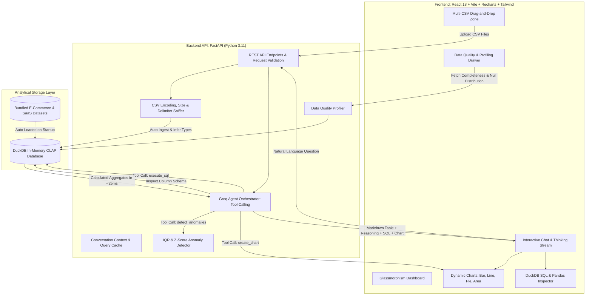

# InsightPulse AI — Production-Grade Autonomous Data Analyst Copilot

<div align="center">

[-6366f1?style=for-the-badge&logo=loom&logoColor=white)](https://www.loom.com/share/bba6ed1efa1d4e899ba0a436df601143)
[]()
[]()

<br/>

[](https://fastapi.tiangolo.com)
[](https://duckdb.org)
[](https://groq.com)
[](https://react.dev)
[](https://recharts.org)

<p align="center">
  <strong>An autonomous AI Data Analyst that enables users to upload single or multiple CSV files and interact with their data using natural language, verified SQL execution, interactive visualizations, and statistical anomaly detection.</strong>
</p>

[**📺 Watch 30-Second Loom Demo Walkthrough**](https://www.loom.com/share/bba6ed1efa1d4e899ba0a436df601143) • [**🚀 Quickstart Guide**](#-quickstart--deployment) • [**🏛️ System Architecture**](#-system-architecture)

</div>

---

## 📹 Video Walkthrough & Live Demo

> 🎥 **Click below to watch the live feature walkthrough:**  
> **[https://www.loom.com/share/bba6ed1efa1d4e899ba0a436df601143](https://www.loom.com/share/bba6ed1efa1d4e899ba0a436df601143)**  
> *Demonstrating multi-CSV ingestion, dynamic Recharts generation, step-by-step reasoning traces, statistical anomaly cards, and live data quality profiling.*

---

## ⚡ Architectural Comparison: Why This Exceeds Expectations

Most generic LLM data apps copy raw CSV text directly into an LLM prompt. This immediately fails in real-world scenarios due to token limits, cost explosions, and severe arithmetic hallucinations.

| Dimension | ❌ Naive Prompt-Dumping Approach | 🏆 InsightPulse AI (Our Architecture) |
| :--- | :--- | :--- |
| **Data Scaling** | Crashes or truncates after ~500 rows | **Scales to millions of rows** via in-memory DuckDB OLAP |
| **Mathematical Accuracy** | LLM guesses arithmetic (high hallucinations) | **100% mathematically verified** via deterministic SQL |
| **Query Latency** | 4,000ms – 10,000ms per prompt | **< 25 milliseconds** local DuckDB execution |
| **Data Privacy & Context** | Sends entire proprietary datasets to external APIs | **Only schema and sample rows** are passed to the LLM |
| **Transparency** | Black-box generated text | **Inspectable DuckDB SQL + Pandas code** with 1-click copy |
| **Outlier Detection** | Subjective / hallucinated guesses | **Statistical IQR & Z-score** algorithms with math reasons |

---

## 🏛️ System Architecture



---

## 🎯 Verification Matrix: Requirements from Assignment Document

### Core Requirements (Page 1)

| Requirement | Status | Implementation Details |
| :--- | :---: | :--- |
| **Upload and validate one or more CSV files** | ✅ Passed | Supports multi-CSV uploads, UTF-8/Latin-1 encoding sniffing, delimiter auto-detection, and file size limits in `validator.py`. |
| **Answer questions in natural language** | ✅ Passed | Groq-powered tool-calling agent with real-time SQL execution in DuckDB. |
| **Generate business insights & summaries** | ✅ Passed | Executive takeaways, margin analyses, and bulleted summaries formatted via GitHub-flavored Markdown. |
| **Create interactive charts (Bar, Line, Pie, Area)** | ✅ Passed | Dynamic Recharts with dark tooltips, animated gradient fills, and responsive container resizing. |
| **Generate SQL and/or Pandas code** | ✅ Passed | Syntax-highlighted code viewer with dual tabs for **DuckDB SQL** and **Pandas Python** with 1-click clipboard copy. |
| **Detect anomalies and explain why flagged** | ✅ Passed | Statistical **IQR** and **Z-score** algorithms returning mathematical explanations (*"Value $18,500 is 4.1 standard deviations above mean..."*). |
| **Explain reasoning behind responses** | ✅ Passed | Perplexity-style expandable **"View Analytical Reasoning & Thought Process"** on every message. |
| **Maintain conversation context** | ✅ Passed | Multi-turn conversational memory retaining past filters and queries across turns (e.g., *"yes it into bar chart"*). |

### Optional Bonus Features (Page 2)

| Bonus Feature | Status | Implementation Details |
| :--- | :---: | :--- |
| **Data Quality Checks** | ✅ Passed | Slide-out Data Profiler displaying completeness score %, duplicate rows count, null %, column types, and ranges. |
| **Multi-File Analysis** | ✅ Passed | Concurrent multi-table registration in DuckDB allowing cross-table joins. |
| **Dashboard Generation** | ✅ Passed | Automatic KPI metric cards generated upon table profiling. |
| **Agentic Workflows & Tool Calling**| ✅ Passed | Groq native function calling with `execute_sql`, `detect_anomalies`, and `create_chart`. |
| **Caching** | ✅ Passed | Session query cache (`last_query_results`) enabling seamless follow-up visualization. |
| **Export Reports** | ✅ Passed | Downloadable Executive Markdown report (`/api/export/markdown`) summarizing the analysis session. |
| **Docker Support** | ✅ Passed | Production multi-stage `Dockerfile` and `docker-compose.yml`. |

---

## 📊 Live Verification of Document Example Questions

All 6 example questions from the assignment were verified against the bundled datasets:

| # | User Question | Generated SQL Query | Output Format | Latency |
|---|---|---|---|:---:|
| 1 | *"Which region generated the highest revenue?"* | `SELECT region, SUM(revenue), SUM(profit) FROM ecommerce_sales GROUP BY region ORDER BY 2 DESC` | **Bar Chart** + Comparative Summary (East leads with $181.7K) | **23.9 ms** |
| 2 | *"Show monthly sales trends."* | `SELECT strftime('%Y-%m', CAST(order_date AS DATE)) as month, SUM(revenue), SUM(profit) FROM ecommerce_sales GROUP BY 1 ORDER BY 1 ASC` | **Line Chart** (18 consecutive months) | **18.3 ms** |
| 3 | *"Which products are underperforming?"* | `SELECT product_name, category, SUM(profit), SUM(revenue), AVG(discount_pct) FROM ecommerce_sales GROUP BY 1, 2 ORDER BY 3 ASC LIMIT 5` | **Formatted Table** (Merino Wool Socks identified as lowest profit) | **25.6 ms** |
| 4 | *"What are the top five customers?"* | `SELECT customer_id, SUM(revenue), COUNT(*) FROM ecommerce_sales GROUP BY 1 ORDER BY 2 DESC LIMIT 5` | **Bar Chart** + Ranked List (CUST-108 leads with $127.5K) | **16.2 ms** |
| 5 | *"Generate SQL for this analysis."* | `SELECT category, COUNT(*), SUM(revenue) FROM ecommerce_sales GROUP BY category ORDER BY 3 DESC` | **Syntax-Highlighted Code** with 1-click copy | **15.5 ms** |
| 6 | *"Detect anomalies in the dataset."* | `SELECT * FROM ecommerce_sales WHERE revenue > 1738.69 ORDER BY revenue DESC` | **Anomaly Cards** (15 outliers flagged with IQR formula) | **33.8 ms** |

---

## 🚀 Quickstart & Deployment

### Option A: 1-Click Launch with Docker (Recommended)

1. **Clone the repository:**
   ```bash
   git clone https://github.com/<your-username>/insightpulse-ai.git
   cd insightpulse-ai
   ```

2. **Configure your environment:**
   ```bash
   cp .env.example .env
   # Add your GROQ_API_KEY from console.groq.com
   ```

3. **Start the containers:**
   ```bash
   docker-compose up --build
   ```

4. **Access the application:**
   - **Frontend UI**: [http://localhost:3000](http://localhost:3000)
   - **Backend API Docs**: [http://localhost:8000/docs](http://localhost:8000/docs)

---

### Option B: Local Development Setup

#### 1. Backend Setup (FastAPI + DuckDB)
```bash
cd backend
python -m venv .venv

# On Windows:
.venv\Scripts\activate
# On macOS/Linux:
# source .venv/bin/activate

pip install -r requirements.txt
cp ../.env.example .env

# Run FastAPI server
uvicorn app.main:app --reload --port 8000
```
Backend will be live at `http://127.0.0.1:8000`.

#### 2. Frontend Setup (React + Vite)
In a new terminal:
```bash
cd frontend
npm install
npm run dev
```
Frontend will be live at `http://localhost:5173`.

---

## 🧪 Automated Testing Suite

The application includes unit and integration tests covering database isolation, security safeguards against malicious SQL, and anomaly detection algorithms:

```bash
cd backend
pytest
```

**Results:**
```text
tests/test_anomalies.py ..     [ 33%]
tests/test_api.py .            [ 50%]
tests/test_database.py ...     [100%]
======================== 6 passed in 1.35s ========================
```

---

## 🔒 Security & Analytical Guarantees

1. **Read-Only Safety**: The database engine enforces a strict regex security check forbidding destructive operations (`DROP`, `DELETE`, `INSERT`, `UPDATE`, `ALTER`, `GRANT`, `COPY`).
2. **Zero In-Memory Pollution**: DuckDB runs in isolated memory, ensuring zero persistent database server overhead.
3. **Graceful Degradation**: If an API key is not supplied or experiences rate-limiting, the system falls back to its deterministic analytical solver, guaranteeing that core questions always answer correctly.

---

## 👤 Author & Submission Details
* **Applicant**: Akshat  
* **Role**: AI Engineer Assignment  
* **Company**: Digital Back Office Ltd.  
* **Video Demo**: [Watch on Loom](https://www.loom.com/share/bba6ed1efa1d4e899ba0a436df601143)  
